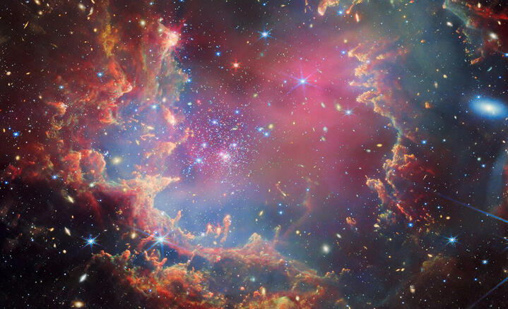

# Black Hole Gravitational Lensing Simulation

This project simulates gravitational lensing caused by a black hole, visualizing how light from a background image is distorted due to the black hole's gravitational field. The effect is computed using the Schwarzschild metric and the deflection angle formula.

## How It Works
Gravitational lensing occurs when light from a distant source bends around a massive object due to gravity. This effect, predicted by General Relativity, results in distorted or magnified images of background objects.

The simulation:
1. Loads a background space image.
2. Computes light bending using the deflection angle formula:
   $\alpha = \frac{4GM}{c^2 r}$
3. Maps the deformed light paths onto a new image using `scipy.ndimage.map_coordinates`.
4. Animates the black hole moving across the image, dynamically applying the lensing effect.

## Requirements
- Python 3.x
- NumPy
- Matplotlib
- SciPy
- FFmpeg (for saving animations)

## Installation
```sh
pip install numpy matplotlib scipy
```

## Usage
1. Clone the repository:
```sh
git clone https://github.com/YourUsername/BlackHoleLensing.git
cd BlackHoleLensing
```
2. Place a space background image in the project folder (e.g., `space_background.jpg`).
3. Run the script:
```sh
python black_hole_lensing.py
```
4. The animation will be generated and saved as `black_hole_pos.mp4`.

## Example Output
The code works with an uploaded image that reproduces a space background being distorted by a black hole. You need then to upload the file space_background.jpg given (see below) or any similar file.
  


## Author
Created by Hugo Alexandre (@HugoGW). Feel free to contribute or reach out for improvements!

